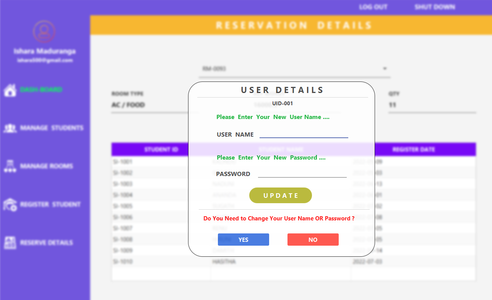

# Hostel_Management_System-Hibernate

## Description

#### This Application is Stand Alone Application.And this Application developed for solving some problems of hostel students and gives best Efficient service for them

## Main Functions of Application
* Login Interface
* Home/Main DashBoard Interface
* Students Manage Interface
* Rooms Manage Interface
* Register Students Interface
* Reserve Details Interface
* Change Login Details 

#### Also,This Application Optimized to Provide for Desktop Devices.

## :link: Basic Background of Application

### 🌱 Login Interface

### 🌱 Home/Main DashBoard Interface

### 🌱 Students Manage Interface

### 🌱 Rooms Manage Interface

### 🌱 Register Students Interface

### 🌱 Reserve Details Interface

### 🌱 Change Login Details 

## Technology/Framework used
* Hibernate
* Java
* CSS
* JavaFx

## License
**Copyright @ 2022 All Right Reserved By Ishara Maduranga**
